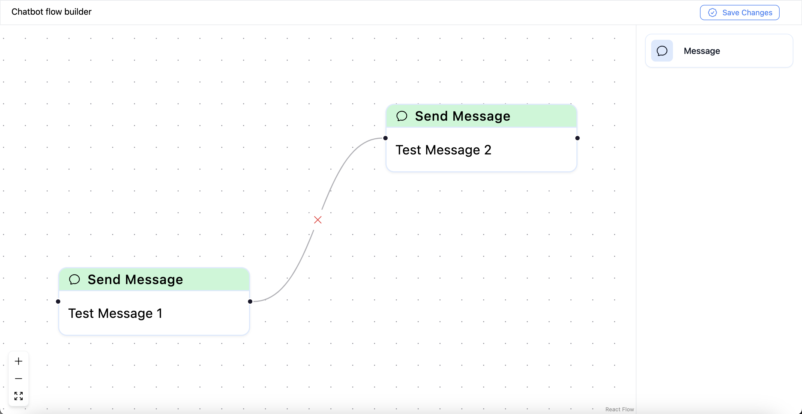

# Chatbox flow builder



[live demo](https://chatbot-flow-bitespeed.vercel.app/)

## Tech Stack
- **Framework**: React
- **Styling**: Tailwind CSS
- **Deployment**: Vercel
- **Type Safety**: TypeScript
- **Libraries**: Reactflow, twMerge, react-toastify

## Running Locally

1. Clone the repository: 
  ```
  git clone https://github.com/JayP09/chatbot-flow-bitespeed.git
  ```
2. Navigate to the project directory: 
```
cd chatbot-flow-bitespeed
```
3. Install dependencies:
```
yarn
```
4. Start the development server: 
```
yarn dev
```
5. Open the website in your browser: 
```
http://localhost:5173/
```

